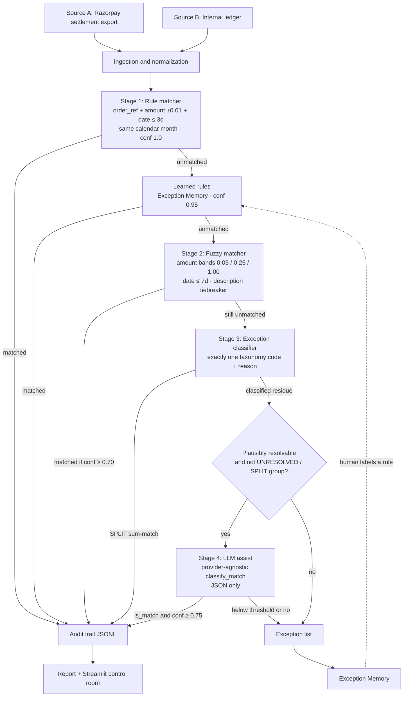
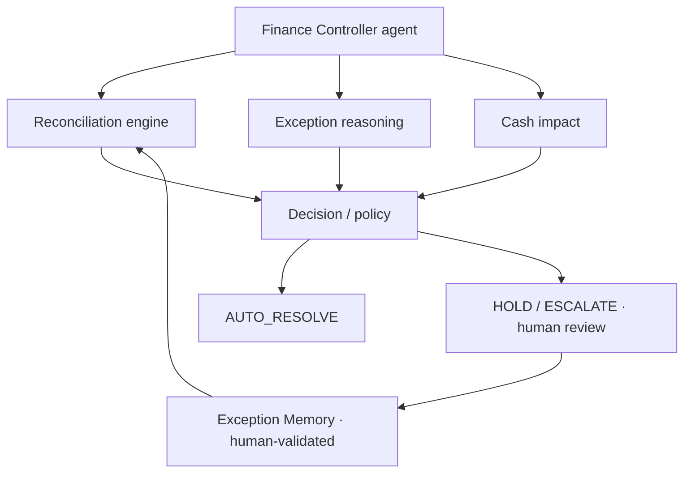
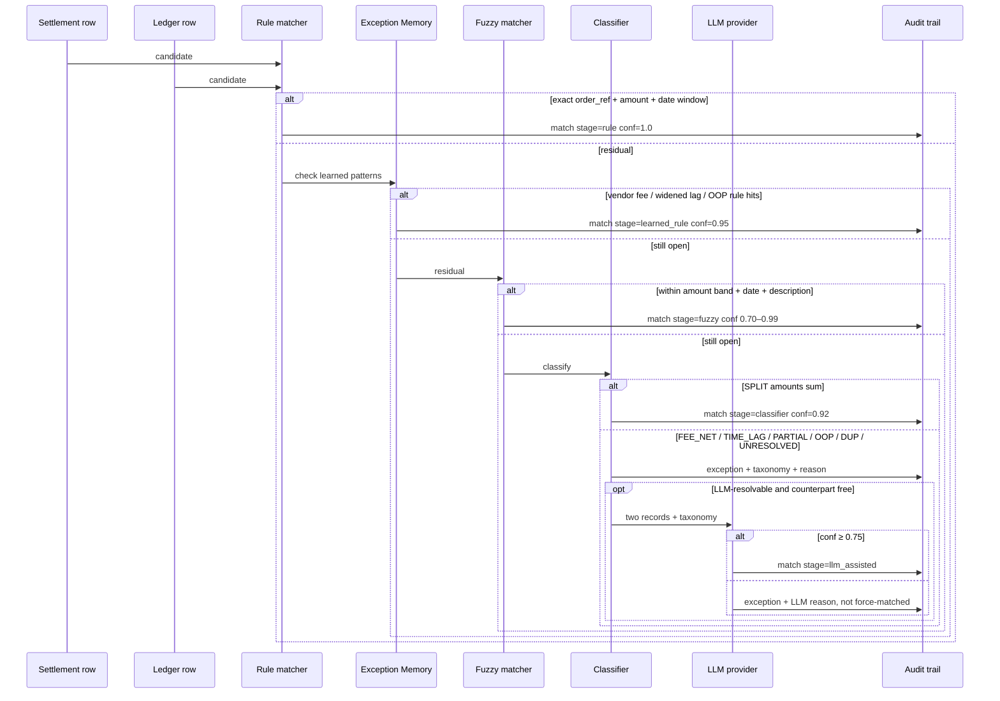
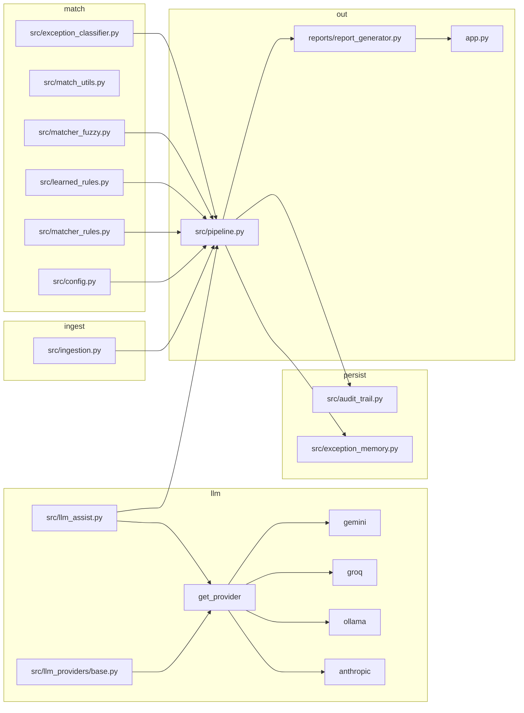
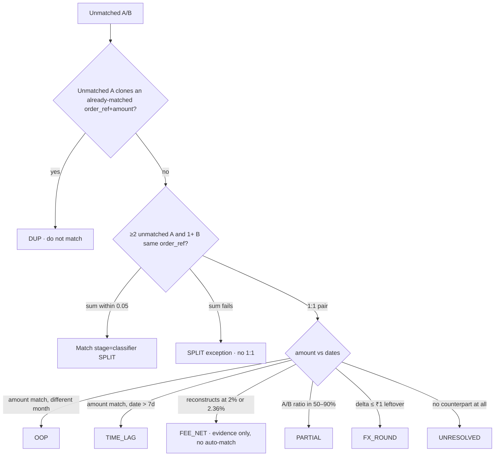
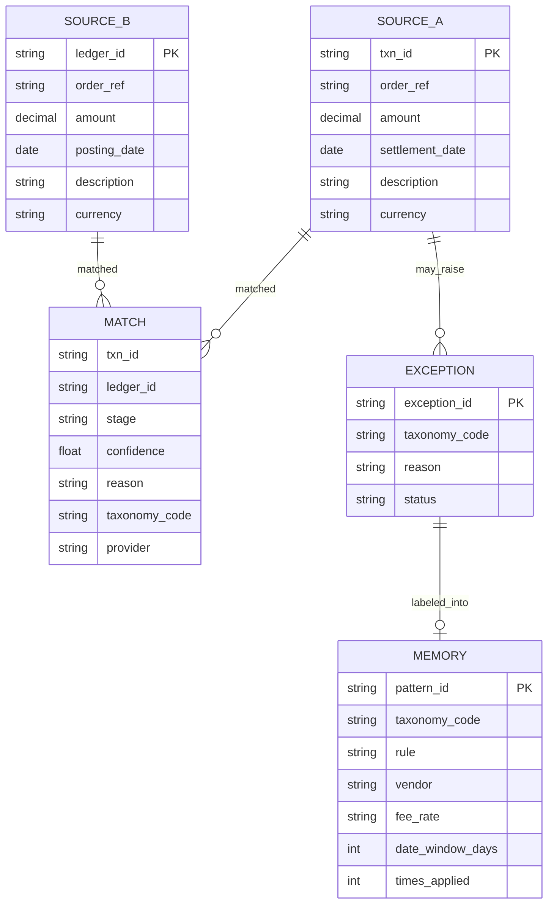
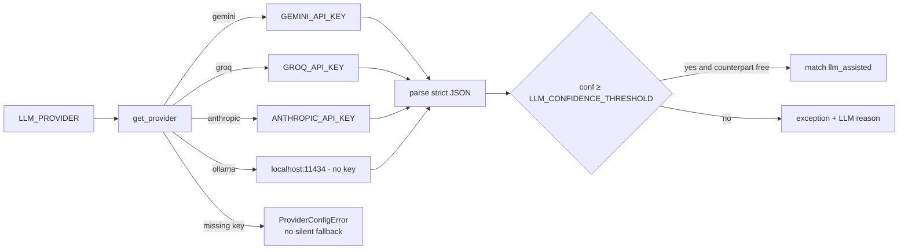
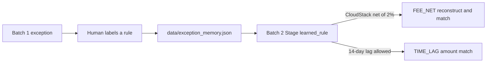

# Finance Controller Agent — Architecture

Reconciliation agent for **Razorpay Buildathon**, track **AI Finance Controller**.

Start here for the full story (problem, why this PS, solution, mermaid architecture): **[PROJECT.md](PROJECT.md)**.

This file is extra LLD / runbook: problem recap, HLD, LLD, data, pipeline, taxonomy, LLM contract, exception memory, metrics, and how to run it.

---

## 1. Problem

Match a Razorpay-style **settlement export** (source A) to an **internal ledger** (source B) on a 50+ record batch, and produce:

1. A **stage-wise match rate** (rule / learned_rule / fuzzy / classifier / LLM-assisted)
2. A **precision estimate** on the hard matches (scored against hidden ground truth the matcher never sees)
3. A **complete exception list** — every unresolved record has a taxonomy code and a one-sentence reason
4. A **compounding effect** — close 2 and close 3 are **full-size reruns** (same n, new IDs) that get faster because a human labeled close-1 exceptions into Exception Memory (human-validated policy, not ML)

The bar we build against: *throughput plus measured accuracy plus an honest exception list. One cherry-picked match proves nothing.*

---

## 2. Core design principle

**Deterministic matching first.** LLM calls only as a **confidence-gated assist** on residual ambiguous records.

- Never a silent black box
- Never force-match below a confidence threshold (fuzzy floor 0.70, LLM floor 0.75)
- Every match and every exception is logged with: record ids, stage, confidence, taxonomy (if exception), reason, timestamp
- The audit trail is the product, not polish

---

## 3. High-level design (HLD)





The **matcher is unchanged**: rule → learned_rule → fuzzy → classifier → gated `classify_match`. The controller layer sits **above** it: it does not invent matches; it decides what the leftover *means* for a close (HOLD vs ESCALATE), ranks ₹ at risk, and turns a human sentence into the next close's `learned_rule`.

- Every match traces to *which* stage resolved it
- The LLM only sees the hardest residue, with a stated confidence and reason
- Exception Memory is the compounding piece: labeled patterns skip fuzzy/LLM on the next batch

---

## 4. Record-level sequence (HLD)



---

## 5. Low-level design (LLD)

### 5.1 Module map



### 5.2 Pipeline order (code path)

`src/pipeline.py :: run_pipeline`

1. `load_source_a` / `load_source_b` — drop any accidental ground-truth columns
2. `match_rules` — 1:1 greedy by `(date_delta, amount_delta, id)`
3. `apply_learned_rules` — FEE_NET reconstruct, TIME_LAG window, OOP adjacent month
4. `match_fuzzy` — scored globally, then greedy by confidence
5. `classify_exceptions` — SPLIT sum-match; everything else coded, not force-matched
6. `run_llm_assist` — one `classify_match` per A/B pair that still has a free counterpart
7. Invariant: every remaining exception has non-empty `taxonomy_code` and `reason`
8. Persist exceptions to `data/last_exceptions.json` for the label CLI

Learned rules sit **after Stage 1 and before fuzzy**, so batch 2 never pays the fuzzy/LLM cost for a pattern already labeled.

### 5.3 Matching gates

| Stage | Amount | Date | Other | Confidence | Force-match? |
|---|---|---|---|---|---|
| Rule | ≤ ₹0.01 | ≤ 3 days, same month | exact `order_ref`, same currency | 1.00 | only if all gates pass |
| Learned FEE_NET | reconstruct gross at stored % | not required | vendor substring | 0.95 | only if reconstruction hits |
| Learned TIME_LAG | ≤ ₹0.01 | ≤ stored window (default 14d) | same `order_ref` | 0.95 | only if amount matches |
| Fuzzy | bands 0.05 / 0.25 / 1.00 | ≤ 7 days, same month | `token_set_ratio` ≥ 40 | 0.90 − 0.10×band − date penalty, cap 0.99 | discarded if &lt; 0.70 |
| Classifier SPLIT | combo sum ≤ ₹0.05 | — | 2–4 legs, same `order_ref` | 0.92 | only exact combinatorial sum |
| LLM | model opinion only | — | taxonomy already assigned | model 0–1 | accepted only if `is_match` and ≥ 0.75 **and** counterpart still free |

1:1 assignment is absolute: a ledger row already taken cannot be assigned again, including by the LLM (covers DUP).

### 5.4 Exception classifier (LLD)

Priority on residuals after Stage 2:



FEE_NET is **proven** by reconstructing gross from 2.00% and 2.36% (Razorpay 2% + GST = 2.36%) and written into the reason, but it is **not auto-matched**. That leaves a human-labelable exception so Exception Memory can fire on batch 2.

---

## 6. Data model



Ground truth lives only in `data/ground_truth.csv` (`gt_group`, `taxonomy`, expected ids). Ingestion **drops** those columns if someone concatenates them onto a source file. Precision is computed in `reports/report_generator.py` after the fact.

### Seeded traps (batch 1)

| Taxonomy | Groups | Intent |
|---|---|---|
| CLEAN | 55 | Stage 1 exact |
| DUP | 4 | 1:1 leaves one extra settlement |
| SPLIT | 3 | two A rows sum to one B |
| FX_ROUND | 6 | ±0.01 to ±0.05 paise |
| FEE_NET | 4 | CloudStack 2%, Nimbus 2.36% |
| TIME_LAG | 3 | T+9 / T+10, outside 7d window |
| PARTIAL | 3 | 20–40% refunded |
| OOP | 2 | July books, August settlement |
| UNRESOLVED | 2 | one orphan A, one orphan B |

Batch 2 and batch 3 are **full-size twins** of batch 1 (same trap mix, new IDs). Compare 71/88 to 76/88, never 16/18 next to 71/88.

Eval packs live in `data/eval/` (easy / adversarial / shifted). Live inject rows: `data/stress_scenarios.json`.

---

## 7. LLM provider contract

All providers implement one method and return one shape:

```text
classify_match(record_a, record_b, taxonomy_code) ->
  { "is_match": bool, "confidence": float, "reason": str }
```

The prompt template is **identical** across Gemini, Groq, Ollama, and Anthropic. Switching `LLM_PROVIDER` changes the model, not the matching policy.



HTTP layer: retry with exponential backoff on 429/5xx, then a clear rate-limit error. Free tiers throttle; the run must not die silently.

This repo is configured to use **Groq** via `.env` (`LLM_PROVIDER=groq`, model `openai/gpt-oss-20b` — Llama 3.1 8B Instant was retired on free/dev tiers in August 2026). The key stays in `.env` (gitignored). Do not paste keys into docs, CSVs, or the audit log.

---

## 8. Exception Memory (the compounding piece)



CLI:

```bash
python -m src.exception_memory label exc-A-pay_A00076 "CloudStack SaaS settlements are net of 2% fee" --taxonomy FEE_NET --vendor "CloudStack SaaS" --fee-rate 0.02
python -m src.exception_memory label exc-A-pay_A00080 "Allow 14-day settlement lag for delayed payouts" --taxonomy TIME_LAG --date-window-days 14
```

Vendor is bound **only** for FEE_NET. A TIME_LAG sentence containing the word “settlement” is not parsed as a vendor name.

---

## 9. Metrics (what we show at demo)

Precision is measured **only on matched pairs**. We buy a high number by refusing to guess on the rest — that is why the exception list matters as much as the match rate. Objective: **zero false-positive matches**, not artificial 100% coverage.

| Metric | Close 1 (no LLM, typical) | Close 2 after CloudStack 2% + 14d lag |
|---|---|---|
| Match rate A | 80.7% (**71/88**) | higher on **the same n=88**, new IDs |
| Verified precision | 100% (**68/68** pairs, **0** false-positive) | 100% on matched pairs |
| A-side exceptions | coded + ranked by ₹ | fewer FEE_NET / TIME_LAG |
| Learned rule | 0 | 2+ |
| LLM calls | residue only | drop when memory hits first |

Scale (labeled **estimates**): wall-clock is measured; $/1,000 records assumes this exception mix and ~$0.0002 per LLM call. Rules are ~free; LLM assist is the expensive tail.

Exception Memory is **human-validated policy**, not ML. Do not pitch it as a trained model.

---

## 10. Demo script (3 minutes)

Story, not a feature tour. Full lines: [docs/PITCH.md](PITCH.md).

1. Verification problem, not matching. Refuse to fabricate certainty.
2. Close 1. Say **80.7% (71/88)** and **100% (68/68 matched pairs, 0 false-positive)** plus the precision-scope sentence.
3. Exceptions: orphan ESCALATE, DUP, FEE_NET HOLD, one LLM refusal if present.
4. Label CloudStack 2% + 14-day lag. Call it policy memory, not ML.
5. Close 2 (same n). Learning curve. Stress inject if a judge offers a scenario.

---

## 11. Repository map

```text
finance-controller-agent/
├── app.py                          Streamlit control room
├── components/                     dashboard views + charts
├── styles/theme.css
├── data/
│   ├── generate_synthetic_data.py
│   ├── source_a.csv / source_b.csv
│   ├── batch2_source_*.csv / batch3_source_*.csv
│   ├── eval/                       easy · adversarial · shifted
│   ├── stress_scenarios.json       live inject
│   ├── ground_truth.csv            scoring only
│   └── exception_memory.json
├── src/
│   ├── pipeline.py
│   ├── controller_policy.py        HOLD / ESCALATE · ₹ impact · severity
│   ├── observability.py            LLM funnel · labeled $/1k estimates
│   ├── matcher_*.py / exception_*.py / llm_*
├── reports/report_generator.py
├── tests/
├── docs/ARCHITECTURE.md            this file
└── .env.example
```

---

## 12. Runbook

```bash
python -m pip install -r requirements.txt
python data/generate_synthetic_data.py
copy .env.example .env          # then set LLM_PROVIDER + the matching key
python -m pytest -q
python -m src.pipeline          # uses .env; add --no-llm to skip
streamlit run app.py
```

Environment:

| Variable | Required when |
|---|---|
| `LLM_PROVIDER` | always (default `gemini`; this demo uses `groq`) |
| `GROQ_API_KEY` | `LLM_PROVIDER=groq` |
| `GEMINI_API_KEY` | `gemini` |
| `ANTHROPIC_API_KEY` | `anthropic` |
| `OLLAMA_HOST` / `OLLAMA_MODEL` | optional for `ollama` |
| `LLM_CONFIDENCE_THRESHOLD` | optional, default `0.75` |

Missing key for the **selected** provider is a hard error at `get_provider()`, surfaced as “LLM assist skipped: …” in the pipeline — never a silent hop to another vendor.
