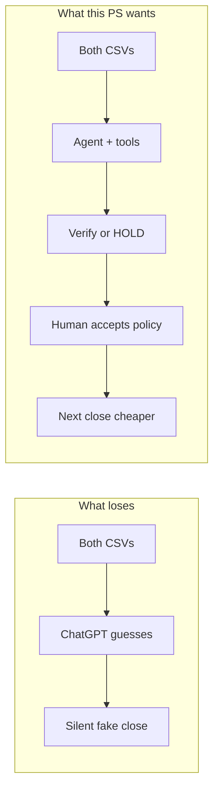
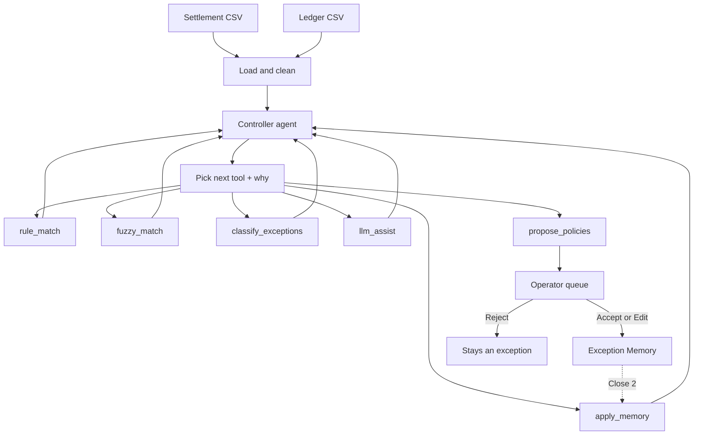
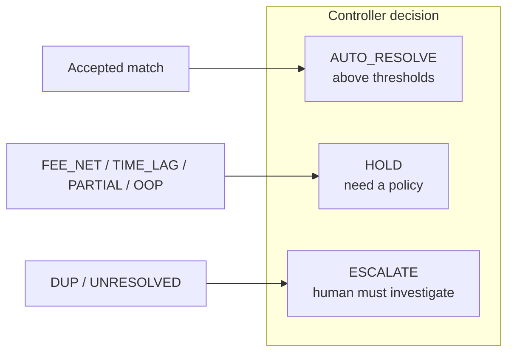
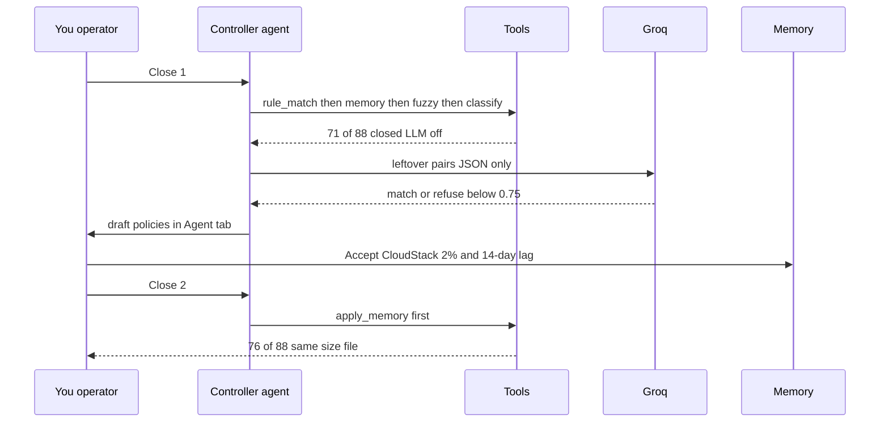

# AI Finance Controller — simple guide

**Razorpay Buildathon · Track: AI Finance Controller**

Read this if you know nothing about the project. Use it for the demo.

**One line:** We do not invent a match. We verify the close. A human accepts new policy. The next file is cheaper.

Full technical story: [PROJECT.md](PROJECT.md) · Spoken 3 minutes: [PITCH.md](PITCH.md)

---

## 1. Why this problem statement?

Every month an Indian merchant on Razorpay must **close the books**.

Two files arrive:

| File | Meaning | Example columns |
|---|---|---|
| **Source A** | Razorpay settlement export — money that actually landed | `txn_id`, `order_ref`, `amount`, `settlement_date`, `description` |
| **Source B** | Internal ledger — what finance posted in the books | `ledger_id`, `order_ref`, `amount`, `posting_date`, `description` |

They *almost* match. Then they do not:

- 1–2 **paise** difference (rounding / FX)
- Settlement is **net of 2% fee**, ledger is **gross**
- One order, **two payouts** (split)
- The **same order twice** (duplicate capture)
- Money same, date **9 or 20 days late**
- **Refund** so you only got 60–80%
- Ledger in **July**, settlement in **August** (wrong period)
- A row with **no partner at all** (orphan)

If you dump both CSVs into ChatGPT, it will **guess** matches. A finance person will not sign that. The track asks for an **agent**, not a chatbot and not a silent Excel macro.

Judges score:

1. **Throughput** — a full batch, fast, stage by stage  
2. **Accuracy you can attack** — precision vs hidden labels the matcher never saw  
3. **Honest leftovers** — every miss has a code and a reason  

One lucky AI match proves nothing.



---

## 2. What is the problem (the PS)?

**Input:** 50+ settlement rows vs ledger rows (we use **88 vs 81**).

**Output:**

1. Match rate **by stage** (rule / memory / fuzzy / classifier / LLM)
2. **Precision** on pairs we did match (hidden ground truth)
3. A **full exception list** (no silent drops)
4. Proof that **Close 2 is better** because a human labeled Close 1 — same size file, new IDs

**Honesty line (say this before they ask):**

> Precision is only on matched pairs. We buy 100% by refusing to guess. That is why the exception list matters as much as the match rate. We want **zero bad matches**, not a fake 100% close.

---

## 3. Why is this different?

| Usual “AI recon” | This project |
|---|---|
| Whole file into an LLM | Rules first. LLM last, two rows only |
| Silent match | Floor 0.70 fuzzy, 0.75 LLM. Below that = exception |
| “No match” | Code + reason + rupees + HOLD or ESCALATE |
| Next file starts from zero | Exception Memory (human accepted policy, **not ML**) |
| “The AI is 100% accurate” | 100% of **matched pairs**. Leftovers are the product |
| Hidden script of layers | **Agent + tools**. Human **Accept / Edit / Reject** |
| Tiny batch 2 vs big batch 1 | Closes 1, 2, 3 are all **88 vs 81** |

---

## 4. How it works (simple)

Think of a **controller** (the agent) and a toolbox.

**Tools** (matching math is the old, tested code — we did not change it):

| Tool | What it does |
|---|---|
| `rule_match` | Same order, amount within ₹0.01, date within 3 days, same month. Confidence **1.0** |
| `apply_memory` | Policies a human already accepted (e.g. CloudStack = net 2%) |
| `fuzzy_match` | Small amount/date slack. Below **0.70** = no |
| `classify_exceptions` | Give every leftover **one code**. Splits that **sum** can match. Fee-net is **proved** but not auto-matched |
| `llm_assist` | Groq sees **two records + a code**, returns JSON. Below **0.75** = no |
| `propose_policies` | Draft a reason + solution for leftovers. **Does not apply them** |

**Charter** (the agent is not allowed to break this):

- Never skip the exact-match floor  
- Never write a new policy by itself  
- LLM only classifies a pair  
- A **human operator** Accepts, Edits, or Rejects  





---

## 5. The leftover codes

| Code | In plain English | Demo row | Agent / human |
|---|---|---|---|
| DUP | Extra settlement, ledger already used | `pay_A00057` | ESCALATE. Do not save a “match anyway” rule |
| SPLIT | Two payouts, one invoice | classifier often matches the sum | HOLD if leftover |
| FX_ROUND | Off by paise | often fuzzy | HOLD if leftover |
| FEE_NET | Net of platform fee | `pay_A00076` CloudStack 3352.58 vs 3421 | HOLD. Agent drafts 2% rule. **You Accept** |
| TIME_LAG | Same amount, date too late | `pay_A00080` T+9 | HOLD. Agent drafts 14-day window. **You Accept** |
| PARTIAL | Refund / not full amount | `pay_A00083` | HOLD. Do not glue to full gross |
| OOP | July books, August settle | `pay_A00086` | HOLD. Period is a human call |
| UNRESOLVED | No partner | `pay_A00088` | ESCALATE. We seeded this so we cannot fake 100% |

**Out of box:** a **3% fee** is not in our 2% / 2.36% table. Agent drafts “maybe 3%” for the operator. It does **not** force-match.

---

## 6. What the numbers mean

**Close 1, LLM off (typical):**

| Number | Meaning |
|---|---|
| **80.7% (71/88)** | 71 settlements auto-closed |
| **100% (68/68, 0 false)** | Every accepted **pair** was right vs hidden labels |
| ~17 A-side exceptions | Coded, not dropped |
| Memory 0 | Empty on purpose so you teach it live |

**After you Accept CloudStack 2% + 14-day lag, Close 2 (same 88 rows, new IDs):**

| Number | Meaning |
|---|---|
| **86.4% (76/88)** | Fair comparison — same size |
| **5 learned_rule** | Memory fired **before** fuzzy/LLM |
| **100% (73/73)** | Still zero false matches |

**If Groq is ON**, Close 1 may look like **~89.8% (79/88)** because some residue clears 0.75. Always say the **n**. Always show **refusals** (e.g. 8 accepted, 4 refused).

---

## 7. Dashboard — what each thing is

Open `http://localhost:8501` (or 8502).

### Left sidebar

| Control | What it does | Demo? |
|---|---|---|
| **Confidence-gated LLM assist** | ON = Groq on leftovers. OFF = rules only | ON if Groq works; OFF if 429 |
| **▶ Close 1** | Run 88 vs 81 | **Yes — first click** |
| **Close 2** | Same size, new IDs, uses accepted memory | **Yes — after Accept** |
| **Close 3** | Third full close | Extra time only |
| **Inject rows + Stress** | Add 3% fee / T+20 / orphan | If a judge asks |
| **Eval packs** | easy / adversarial / shifted vendors | If they ask “other data?” |
| **Your files** | Upload real CSVs | Only if they ask |

### After Close 1 — six KPI boxes

Say the **n**: “79 of 88”, not “about 90%”.

Then the precision sentence. Then ₹ at risk. Then wall-clock seconds.

### Six stage boxes

Rule → Memory → Fuzzy → Classifier → LLM → Human.  
Memory is **0** until you Accept a proposal.

### Tabs

| Tab | What you show |
|---|---|
| **Command** | Sankey: every settlement went somewhere. Bar chart: ₹ at risk by code |
| **Exceptions** | Ranked list. Orphan, DUP, CloudStack |
| **Agent** | Which tool ran and **why**. Operator queue: **Accept / Edit / Reject** |
| **Matches** | Every pair: stage, confidence, reason |
| **Memory** | Policies after you Accept |
| **Audit** | One JSON line per decision |
| **Learning** | Close 1 vs 2 vs 3 curve |
| **Scale** | Measured time; **labeled** $ estimates per 1,000 rows |
| **Why it wins** | Short bar |

---

## 8. How to run the demo (click + English)

### Before

```text
cd D:\razorpay\finance-controller-agent
streamlit run app.py
```

- Pills: **groq live**, memory **0 policies**
- If Groq errors: turn LLM **off**, still demo

### 0:00 landing (no click)

> “Finance teams have a **verification** problem, not a matching problem. ChatGPT on a CSV will invent matches. We refuse to fabricate certainty. The PS asked for an **agent**: tools, a charter, and a human operator.”

### 0:20 click **▶ Close 1**

> “Eighty-eight settlements versus eighty-one ledger rows. We planted traps on purpose — including two honest orphans. Hidden ground truth exists. **The matcher never sees it.**”

### 0:45 KPIs

> “Match rate — say the fraction on screen. Verified precision 100 percent on matched pairs, **zero** false positives. Precision is **only** on matched pairs. We buy that by refusing to guess. Nine leftovers. Fifty-seven thousand rupees at risk.”

### 1:05 stages + Command Sankey

> “Rules ate the easy majority at confidence 1.0. Memory is empty on purpose. Fuzzy caught paise. Classifier summed splits. Groq only saw residue. If you see 8 accepted and 4 refused — that refusal is the trust signal. The Sankey shows nothing disappeared.”

### 1:25 Exceptions tab

1. **UNRESOLVED `pay_A00088`**  
   > “No counterpart. ESCALATE. We planted this so we cannot fake a 100% close.”
2. **DUP**  
   > “Two settlements, one ledger row. Extra is DUP, not a second match.”
3. **FEE_NET `pay_A00076`**  
   > “We reconstructed 2%. We still did not auto-match. That is how it becomes policy.”

### 1:50 **Agent** tab (this is the new punch)

> “The agent picked **rule_match** first because the charter forbids sending the easy 70% to Groq. Then memory, fuzzy, classifier, LLM. Then **propose_policies**. Nothing became policy yet.”

Pick CloudStack 2% → you **may edit** the sentence → **Accept as-is** or **Accept with edits**.  
Then TIME_LAG 14-day → **Accept**.  
DUP / orphan → **Reject** (not an executable match rule).

> “We do not leave execution to the agent. I am the operator.”

### 2:20 **Close 2** → **Learning** tab

> “Same size close, new IDs. Learned rules fire **before** fuzzy and LLM. Match rate is up. Stop talking.”

Last line:

> “We don’t generate a close. We verify one — and we remember the exceptions.”

### Extra if they ask

- **Stress:** 3% fee. “Not in our fee table. Draft for the operator. No silent match.”  
- **Scale:** “Seconds are measured. Dollars per thousand are **estimates**. Rules are almost free. LLM is the tail. That is why memory exists.”  
- **Is memory ML?** “No. Human-validated policy.”

### Do not

- Open `ground_truth.csv` on stage  
- Label DUP into memory  
- Apologize that match rate is not 100%  
- Read architecture mermaid out loud  

---

## 9. How to start the app

```bash
python -m pip install -r requirements.txt
copy .env.example .env
python -m pytest -q
streamlit run app.py
```

Put `GROQ_API_KEY` only in `.env` (never in git).

```text
LLM_PROVIDER=groq
GROQ_MODEL=openai/gpt-oss-20b
LLM_CONFIDENCE_THRESHOLD=0.75
```

---

## 10. One picture of the whole close



That is the whole product.
