# AI Finance Controller

**Razorpay Buildathon · Track: AI Finance Controller**

A reconciliation **agent** that matches a Razorpay settlement export (source A) to an internal ledger (source B), refuses to fabricate certainty, and remembers human-validated policy so the next close is cheaper.

> We do not generate a close. We verify one — and we remember the exceptions.

| One-pager | Detail |
|---|---|
| Bar | Throughput + measured accuracy + an honest exception list |
| Floor | Deterministic rules first (confidence 1.0) |
| Residue | Taxonomy on every miss · LLM only as a gated JSON assist (floor 0.75) |
| Agent | AUTO_RESOLVE / HOLD / ESCALATE · ₹ at risk · human-validated memory |
| Proof | Hidden ground truth the matcher never reads · same-*n* closes 1–3 · live stress inject |

Speak-this: [PITCH.md](PITCH.md) · Implementation LLD: [ARCHITECTURE.md](ARCHITECTURE.md)

---

## 1. Why this problem statement

Indian merchants on Razorpay still **close books** by lining up two messy files:

- **Source A** — settlement export: what actually landed in the bank (`txn_id`, `order_ref`, `amount`, `settlement_date`, `description`, `currency`)
- **Source B** — internal ledger: what finance posted (`ledger_id`, `order_ref`, `amount`, `posting_date`, `description`, `currency`)

This is not a join-key homework problem. Real closes fail in **finance-shaped** ways:

| What finance sees | Why a generic LLM fails |
|---|---|
| Amount off by 1–5 paise (FX / rounding) | Invents a pair or ignores the delta |
| Settlement is **net of platform fee**, ledger is gross | Force-matches the wrong economic event |
| One order, two payouts (split) | 1:1 glues the wrong leg |
| Extra capture on the same `order_ref` (duplicate) | Assigns the same ledger row twice |
| T+9 / T+20 lag | Treats timing as identity |
| Partial refund vs original gross | Matches 60% of an invoice to the full booking |
| July books, August settlement (out of period) | Closes the wrong month |
| **No counterpart at all** | Fabricates a match so the scoreboard looks clean |

The track bar is explicit: **throughput + measured accuracy + a complete exception list**. One cherry-picked ChatGPT match proves nothing. A finance-literate judge will distrust generative matching without a rules floor, thresholds, and orphans you did not sweep under the rug.

**Why an agent, not a recon script:** matching is necessary but not sufficient. A controller must decide *what to do next* (auto-resolve vs hold vs escalate), rank **₹ at risk**, leave an audit trail, and **learn a policy** so Close 2 does not pay Groq again for CloudStack’s 2% fee.

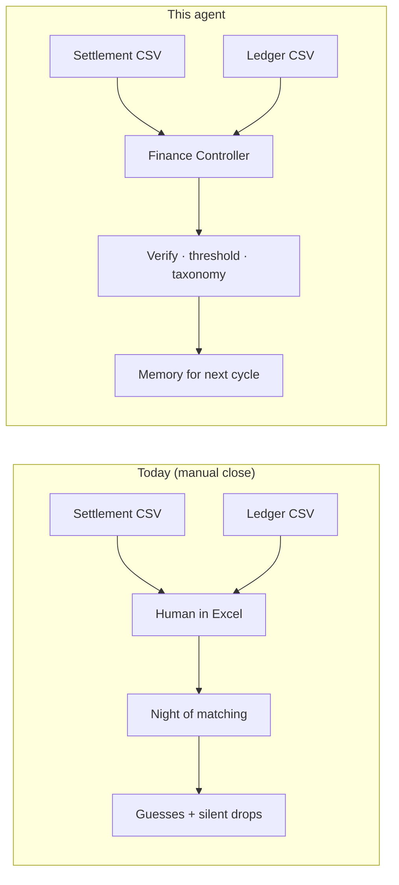

---

## 2. Problem (what we must produce)

On a **50+ record** batch (we ship **88 vs 81**):

1. **Stage-wise match rate** — how many source-A rows closed at rule / memory / fuzzy / classifier / LLM
2. **Precision on matched pairs** — scored against **hidden** ground truth the matcher is forbidden to read
3. **Complete exception list** — every leftover has exactly one taxonomy code and a one-sentence reason
4. **Compounding** — Close 2 and Close 3 are **full-size twins** (same *n*, new IDs). After a human labels Close 1, `learned_rule` fires **before** fuzzy/LLM

Honesty constraint (say this before a judge asks):

> Precision is measured **only on matched pairs**. We buy a high number by refusing to guess on the rest. That is why the exception list matters as much as the match rate. We optimize for **zero false-positive matches**, not fake 100% coverage.

---

## 3. Solution (what we built)

### 3.1 One-line architecture

**Deterministic matching first.** LLM only as a **confidence-gated assist** on residue. A **controller layer** above the matcher decides AUTO_RESOLVE / HOLD / ESCALATE, ranks cash, and stores **human-validated exception memory** (not ML).

### 3.2 Agent vs engine

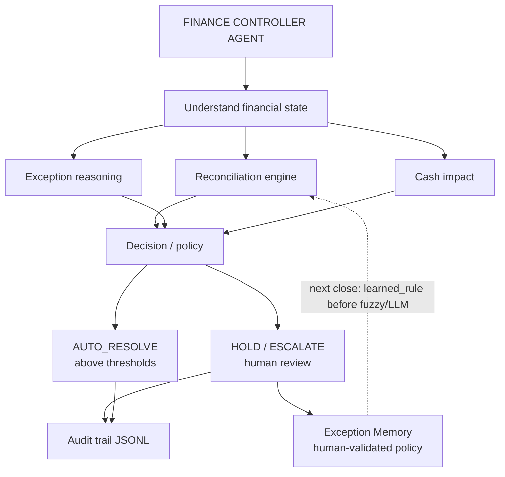

The matcher does **not** change when we swap `LLM_PROVIDER`. Groq / Gemini / Ollama / Anthropic only implement `classify_match`. The controller does **not** invent matches; it interprets leftovers.

### 3.3 Pipeline (the recon engine)

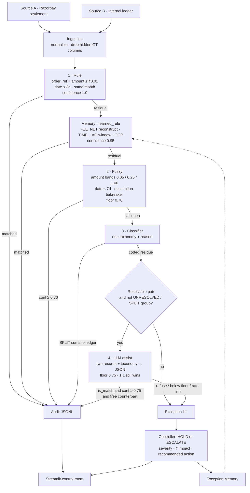

### 3.4 Record-level sequence

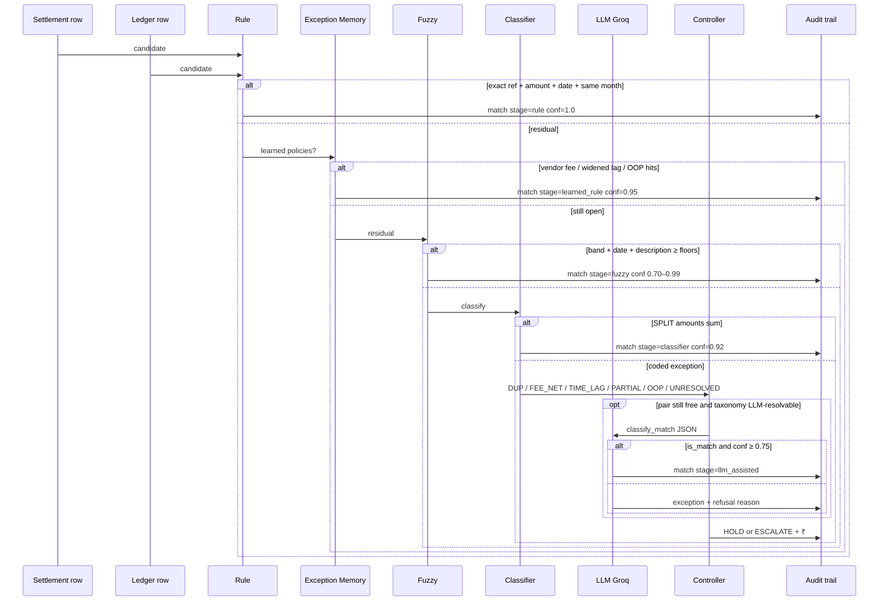

---

## 4. Matching gates (LLD)

Nothing below a floor is force-matched. A consumed ledger row cannot be assigned twice — including by the LLM (this is how **DUP** stays DUP).

| Stage | Amount | Date | Other | Confidence | Auto-match? |
|---|---|---|---|---|---|
| Rule | ≤ ₹0.01 | ≤ 3 days, **same calendar month** | exact `order_ref`, same currency | **1.00** | only if all gates pass |
| Learned FEE_NET | reconstruct gross at stored % | not required | vendor substring | 0.95 | only if reconstruction hits |
| Learned TIME_LAG | ≤ ₹0.01 | ≤ stored window (default 14d) | same `order_ref` | 0.95 | only if amount matches |
| Learned OOP | ≤ ₹0.01 | adjacent month if labeled | same `order_ref` | 0.95 | only if labeled |
| Fuzzy | bands ₹0.05 / 0.25 / 1.00 | ≤ 7 days, same month | `token_set_ratio` ≥ 40 | scaled, **cap 0.99**, **floor 0.70** | discarded below 0.70 |
| Classifier SPLIT | combo sum ≤ ₹0.05 | — | 2–4 legs, same `order_ref` | 0.92 | only exact combinatorial sum |
| LLM | model opinion only | — | taxonomy already assigned | model 0–1 | `is_match` **and** ≥ **0.75** **and** counterpart free |

FEE_NET is **proven** in the reason (reconstruct at Razorpay 2.00% or 2%+GST **2.36%**) but **not auto-matched** until a human labels it or the LLM clears the gate. That is how Exception Memory gets something to learn.

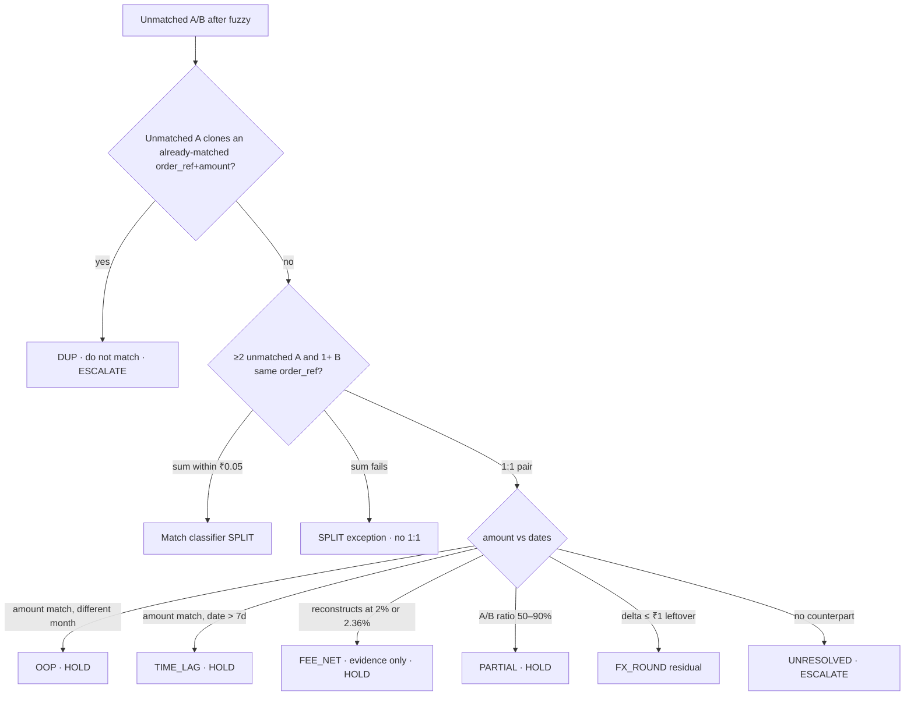

---

## 5. Exception taxonomy

Every leftover gets **exactly one** code + a sentence. “No match” is not allowed.

| Code | Meaning | Controller | Typical demo ID |
|---|---|---|---|
| DUP | Extra settlement; ledger already consumed | ESCALATE | `pay_A00057` / `pay_A00063` |
| SPLIT | Multiple legs; sum-match becomes a match | HOLD if residual | classifier matches |
| FX_ROUND | Paise drift | HOLD if leftover | fuzzy often clears ±0.01 |
| FEE_NET | Net of platform fee vs gross ledger | HOLD until labeled | `pay_A00076` CloudStack 2% |
| TIME_LAG | Amount matches; date outside 7d | HOLD until labeled | `pay_A00080` T+9 |
| PARTIAL | Refund / chargeback shape | HOLD | `pay_A00083` |
| OOP | Posting month ≠ settlement month | HOLD | `pay_A00086` July vs August |
| UNRESOLVED | No plausible counterpart | ESCALATE | `pay_A00088` |

Severity is derived (not invented): UNRESOLVED/DUP rank higher; amount ≥ ₹20,000 bumps a level; tiny FX is low.

---

## 6. LLM contract (gated, not generative)

All providers share **one prompt** and **one JSON shape**. Switching `LLM_PROVIDER` does not change matching policy.

```text
classify_match(record_a, record_b, taxonomy_code) ->
  { "is_match": bool, "confidence": float, "reason": str }
```

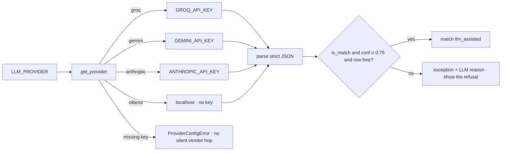

- The model sees **two records and a taxonomy** — never the whole batch.
- Below 0.75, or `is_match: false`, or 1:1 already consumed → **stays an exception**. Showing a refusal is a trust signal.
- HTTP 429 is **not** a crash: remaining pairs stay exceptions; the run completes (free-tier TPM).
- This repo’s demo default: `LLM_PROVIDER=groq`, model `openai/gpt-oss-20b`, floor `0.75`.

---

## 7. Exception Memory (compounding — not ML)

Call it **human-validated exception memory** or **experience-driven policy**. Do not pitch it as machine learning.

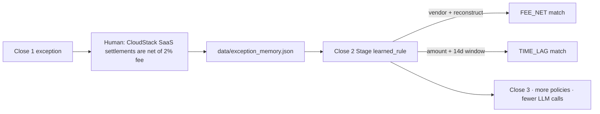

Close 2 and Close 3 are **full-size closes** (88 vs 81, same trap mix, new IDs). Never compare 16/18 next to 71/88.

Typical **no-LLM** proof (matcher never saw labels):

| | Close 1 | Close 2 after CloudStack 2% + 14-day lag |
|---|---|---|
| Match rate | **80.7% (71/88)** | **86.4% (76/88)** |
| Learned-rule hits | 0 | **5** |
| Hidden-GT precision | **100% (68/68 pairs, 0 false-positive)** | **100% (73/73)** |

With Groq on, Close 1 typically rises (e.g. ~**89.8% (79/88)**) because some FEE_NET / TIME_LAG pairs clear 0.75; **precision on matched pairs stayed 100%** in the live run. Always quote **n**. Always show **refusals**.

CLI:

```bash
python -m src.exception_memory label exc-A-pay_A00076 "CloudStack SaaS settlements are net of 2% fee" --taxonomy FEE_NET --vendor "CloudStack SaaS" --fee-rate 0.02
python -m src.exception_memory label exc-A-pay_A00080 "Allow 14-day settlement lag for delayed payouts" --taxonomy TIME_LAG --date-window-days 14
```

---

## 8. Data (seeded traps + eval)

Hidden labels: `data/ground_truth.csv`. Ingestion **drops** GT columns if someone concatenates them onto a source file. Scoring is offline in `reports/report_generator.py`.

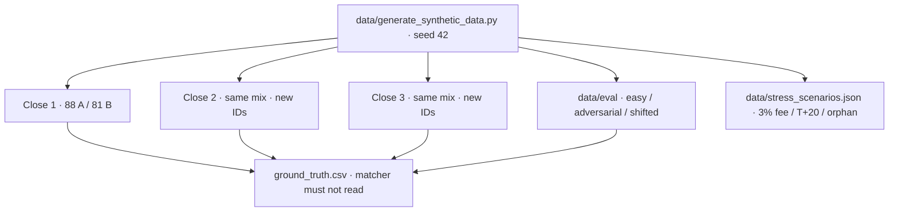

**Close 1 injection (groups):** 55 CLEAN · 4 DUP · 3 SPLIT · 6 FX_ROUND · 4 FEE_NET (CloudStack 2%, Nimbus 2.36%) · 3 TIME_LAG · 3 PARTIAL · 2 OOP · 2 UNRESOLVED (orphan A `pay_A00088`, orphan B).

**Eval packs** (sidebar): easy ≈ all rules; adversarial = denser traps; shifted = unseen vendor strings (Helios / Quark) so CloudStack memory must not blindly apply.

**Live stress:** append 3–5 adversarial rows onto a **working copy** of Close 1. Original CSVs are not mutated.

---

## 9. Data model

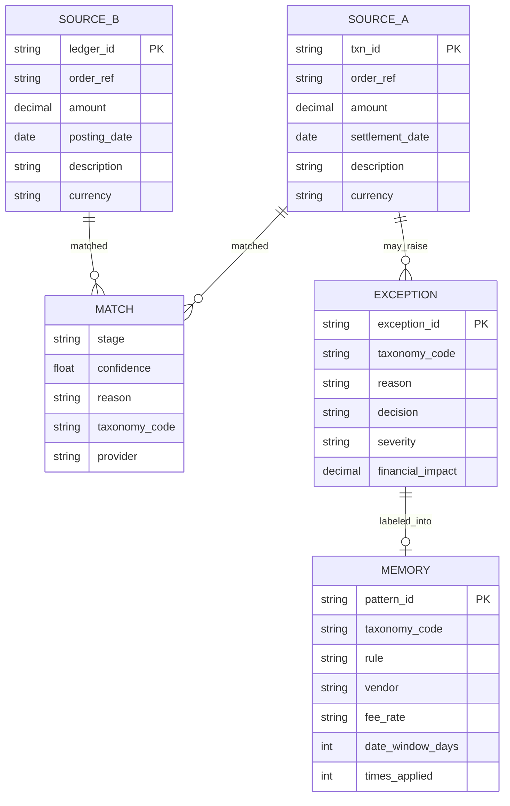

---

## 10. Module map

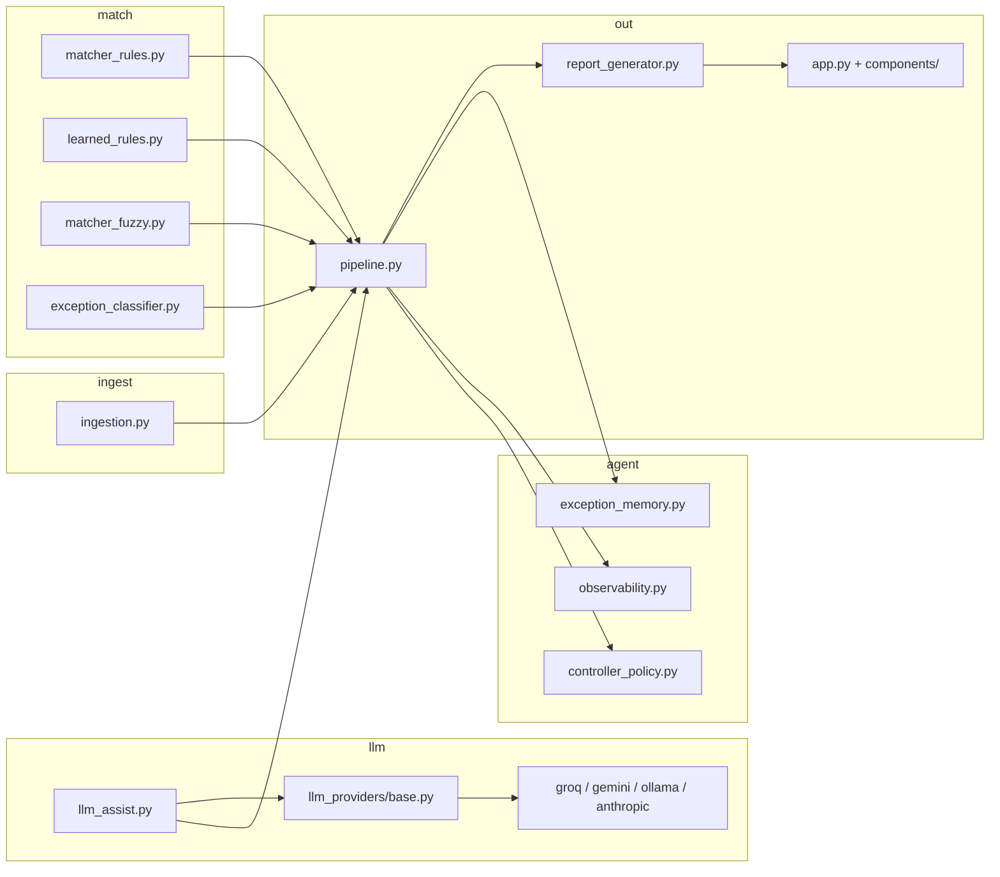

`run_pipeline` order: ingest → **rule → learned_rule → fuzzy → classifier → LLM** → invariant (every exception has code + reason) → amounts / timings / audit events → report.

---

## 11. Metrics (what to put on the slide)

| Metric | Close 1 no-LLM (typical) | Notes |
|---|---|---|
| Match rate | **80.7% (71/88)** | Always quote n |
| Pairs vs A-rows | 68 pairs · 71 A-rows | SPLIT = two A, one pair |
| Verified precision | **100% (68/68, 0 false-positive)** | Hidden GT · matcher never saw it |
| A-side exceptions | coded + ₹ ranked | DUP, FEE_NET, TIME_LAG, PARTIAL, OOP, UNRESOLVED |
| Wall-clock | measured seconds | Scale tab |
| LLM $ / 1,000 | **labeled estimates** | Rules ~free; LLM is the expensive tail |

With LLM on (live dashboard): match rate can rise (e.g. **89.8% (79/88)**) while precision on matched pairs stays **100%**. Point at **accepted vs refused** classify_match calls.

Scale: `src/observability.py` — measured wall-clock; **estimates** (~$0.0002/call, ~12s manual per line) clearly labeled as estimates.

---

## 12. Control room (dashboard)

`streamlit run app.py`

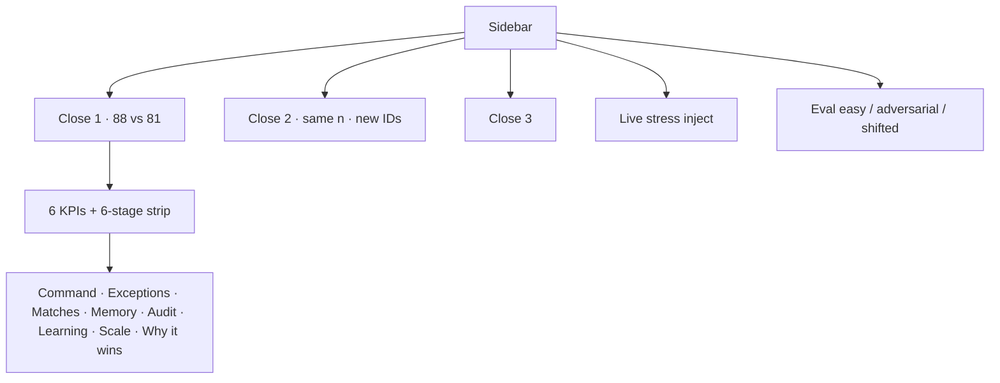

- **Command** — Sankey (every A-row) + ₹ at risk by taxonomy  
- **Exceptions** — severity · HOLD/ESCALATE · LLM refusal · label into memory · CSV/JSON export  
- **Learning** — Close 1 → 2 → 3 curve, same *n*  
- **Scale** — measured time + labeled $/1k  

Demo story (not a feature tour): landing → Close 1 → n + precision sentence → Sankey → orphan + DUP + CloudStack + LLM refusal → save two policies → Close 2 → **stop on the learning chart**.

---

## 13. How this is different

| Typical “AI recon” | This |
|---|---|
| Dump both files into a chat model | Deterministic floor first |
| Silent / forced matches | Thresholds everywhere |
| “No match” | Taxonomy + reason + ₹ + HOLD/ESCALATE |
| One lucky screenshot | Stage-wise rate + hidden-GT precision with **n** |
| Stateless next file | Exception Memory → Close 2 is cheaper |
| “The AI is 100% accurate” | Precision **on matched pairs only**; leftovers are the product |
| Memory called “ML” | Human-validated policy |

---

## 14. How to run

```bash
python -m pip install -r requirements.txt
python data/generate_synthetic_data.py
copy .env.example .env
python -m pytest -q
python -m src.pipeline --no-llm
streamlit run app.py
```

`.env` (demo): `LLM_PROVIDER=groq`, `GROQ_API_KEY=…`, `GROQ_MODEL=openai/gpt-oss-20b`, `LLM_CONFIDENCE_THRESHOLD=0.75`.

If Groq 429s: toggle LLM **off** and re-run. Matching policy is unchanged; residuals stay exceptions.

---

## 15. Repository map

```text
finance-controller-agent/
├── app.py                      Streamlit control room
├── components/                 views + charts (Sankey, learning curve)
├── styles/theme.css
├── data/
│   ├── generate_synthetic_data.py
│   ├── source_a.csv / source_b.csv
│   ├── batch2_source_*.csv / batch3_source_*.csv
│   ├── eval/                   easy · adversarial · shifted
│   ├── stress_scenarios.json
│   ├── ground_truth.csv        scoring only
│   └── exception_memory.json
├── src/
│   ├── pipeline.py
│   ├── matcher_rules.py / matcher_fuzzy.py / learned_rules.py
│   ├── exception_classifier.py / exception_memory.py
│   ├── llm_assist.py / llm_providers/
│   ├── controller_policy.py    HOLD / ESCALATE · ₹ · severity
│   └── observability.py        LLM funnel · labeled scale estimates
├── reports/report_generator.py
├── tests/
└── docs/
    ├── PROJECT.md              this file
    ├── PITCH.md                3-minute spoken script
    └── ARCHITECTURE.md         extra LLD / runbook
```

---

## 16. One line for the room

**Zero bad matches, not fake 100% coverage. Verify the close. Remember the exceptions.**
